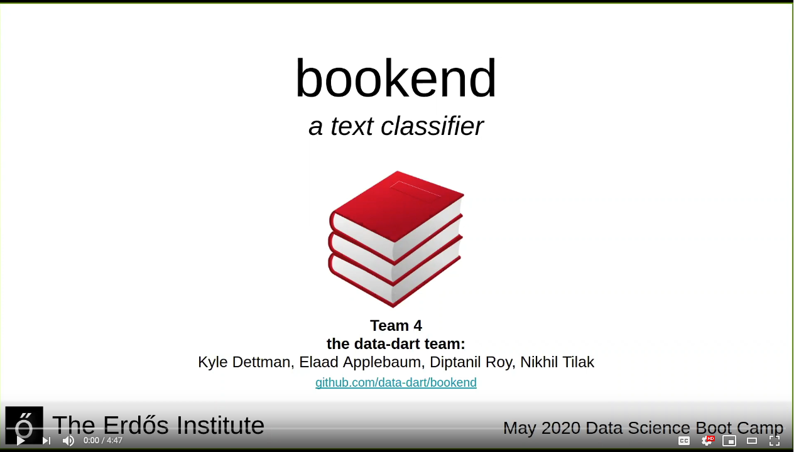
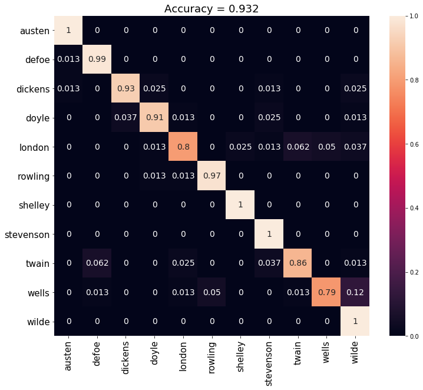

# bookend

<p align="center">
  <a href="https://www.youtube.com/watch?v=P1Sq7T9PvP0">
      
  </a>
</p>
bookend is a classifier for text data. We have built a machine learning model to identify the author of a work given only a selection of text. We are continually adding to the model and improving it, so make sure to check back for updates!

If you would like to try out our classifier for yourself, visit [our live app](http://bookend-data-dart.herokuapp.com/). Enter your own text, and see if we can get it right!

This project is part of The Erdos Institute's  [data science boot camp](https://www.erdosinstitute.org/code). Data sources include [Project Gutenberg](https://www.gutenberg.org/).

## Table of contents
- [About the project](#about-the-project)
  - [Methodology](#methodology)
- [Results](#results)
- [Applications](#applications)
- [Using the code](#using-the-code)
- [References](#references)

## About the project

The goal of this project is to use the body of a text to classify it. To start, we are focusing on predicting the author of a text from the text itself. If we give our algorithm 
> It was the best of times, it was the worst of times...

will it know Charles Dickens wrote it?

### Methodology

We build many features out of the text, and use an ensemble machine learning model to predict the author.

In the future we will expand to allow any-size snippets of text and additional authors, but for now we have focused on identifying 75-sentence chunks of text. We include the following authors, chosen as the top authors on Project Gutenberg who wrote their works in English (We exclude Shakespeare, as his works are largely plays rather than novels or short stories, and we exclude Poe, as his top works are largely collections that overlap with each other in content. We additionally add JK Rowling, who famously wrote the Harry Potter series as well as crime fiction novels under the pseudonym Robert Galbraith):

| Jane Austen | Lewis Caroll | Daniel Defoe | Charles Dickens | Sir Arthur Conan Doyle | Jack London | J.K. Rowling | Mary Shelley | Robert Louis Stevenson | Mark Twain | H.G. Wells | Oscar Wilde |
|-------------|--------------|--------------|-----------------|------------------------|-------------|--------------|--------------|------------------------|------------|-------------|-------------|

Below we briefly summarize several avenues we investigated for engineering features from the text. For more detail, we refer you to the [notebooks](https://github.com/data-dart/bookend/tree/master/notebooks) and [source code](https://github.com/data-dart/bookend/tree/master/src).

#### Bag-of-words

We build a "vocabulary" of known words, assembled from the unique [lemmatized](https://en.wikipedia.org/wiki/Lemmatisation) words in the corpus. For each text sample, we build a feature vector indicating how many times each vocabulary word appeared.

#### Lexical Features

These features are a grab-bag of word and sentence level statistics, like the mean and variation in word and sentence length, and the [Flesch-Kincaid grade level](https://en.wikipedia.org/wiki/Flesch%E2%80%93Kincaid_readability_tests#Flesch%E2%80%93Kincaid_grade_level).

#### Syntactic Features

These features focus on the frequency of different [parts of speech](https://en.wikipedia.org/wiki/Part_of_speech) used by the authors. We classify the words in a text sample into 7 distinct parts of speech categories and then build feature vectors from them. For example, for each text sample, we look at the frequency of nouns, a "noun-verb" bigram, and a "noun-verb-noun" trigram.

#### N-Grams

These features look at the relationship between sets of words and/or characters in a text. For example, relatively how often does the bi-gram (2 word sequence) "how are" appear between "hello how" and "are you"? We can compute the relative similarity between texts in this way by creating graphs of each text, where the nodes contain the n-grams and the edges contain the number of times each node is adjacent to another node, and comparing them using standard graph theory.

## Results

After cross-validation on both individual model parameters and combinations of feature sets, we found our best model was a soft-voting classifier comprised of an SVM classifier on the N-Grams, an SVM classifier on the syntactic features, and a logistic regression classifier on the bag-of-words features.

We tested the model on snippets from previously unseen books. The results, in the form of a confusion matrix (true value on vertical, predicted on horizontal), are shown here. For the time being, we have excluded Lewis Carroll, as his mathematical texts include large swaths of formatted figures and equations that our model does not yet account for.



All-told, the model has a classification accuracy of >90%. The bag-of-words model is by far the most accurate of any individual feature model, with >80% accuracy alone.

## Applications

Here, we briefly discuss future applications of our model, once it is further developed.

### Plagiarism detection

### Troll (and bot) hunting

### Authorship attribution

## Using the code

Read here if you wish to reproduce our results yourself, or use some of the tools we've developed.

We recommend setting up a [conda](https://www.anaconda.com/products/individual) environment if you wish to run any of the code here. This will also install the `src` directory so it can be imported.

To clone the repo and then set up the anaconda environment, do
```
$ git clone https://github.com/data-dart/bookend.git
$ cd bookend
$ conda env create -f environment.yml
```
Then, to activate the new environment,
```
$ conda activate bookend
```

Additionally, the `nltk` package requires external data. This should be downloaded by
```
$ python
>>> import nltk
>>> nltk.download()
```
which will open a GUI that allows you to download the relevant files.

For more information, or for issues relating to `nltk`, please visit https://github.com/nltk/nltk.

## References

Here are some useful links.
